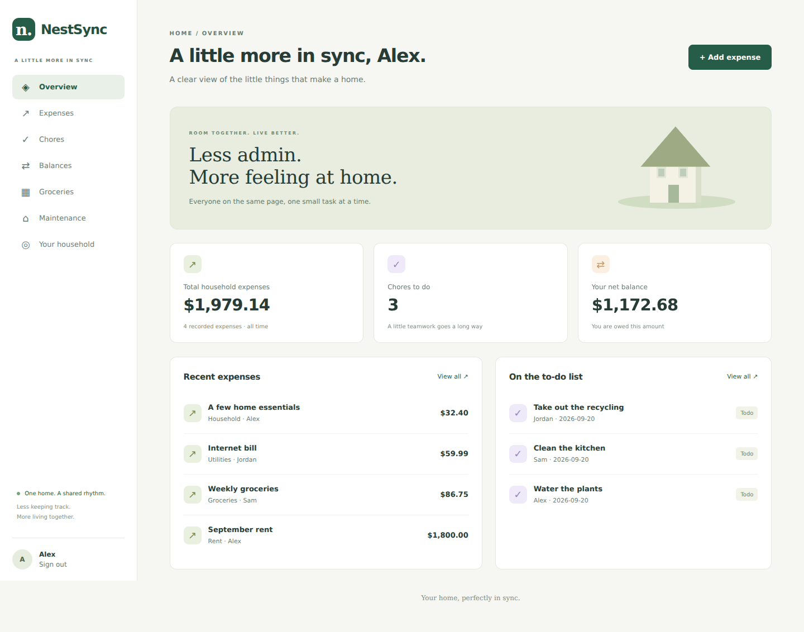
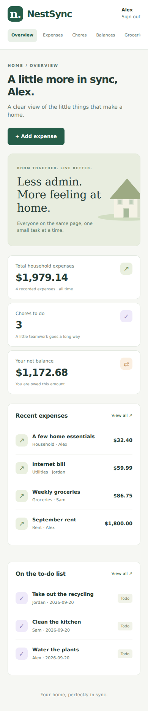
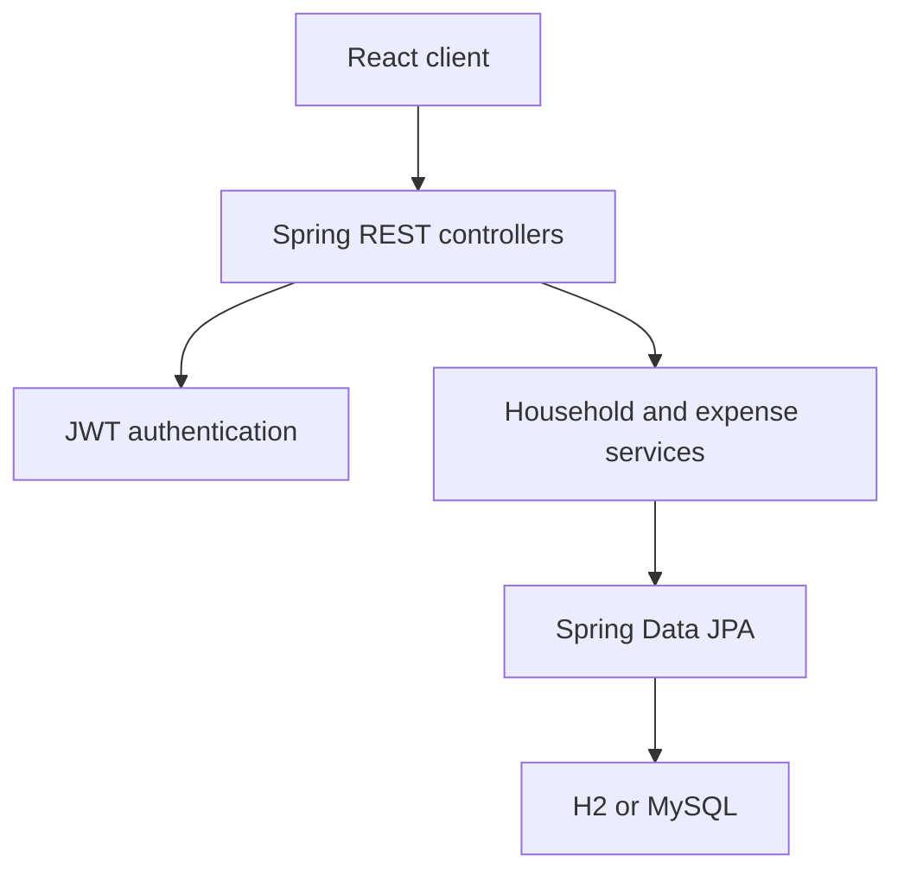

<div align="center">

# NestSync

### Your home, perfectly in sync.

A full-stack roommate management app that brings shared expenses, chores, groceries, and maintenance into one calm space.

[](https://github.com/KhushiShah-swe/NestSync/actions/workflows/ci.yml)
[](https://github.com/KhushiShah-swe/NestSync/actions/workflows/codeql.yml)


[🚀 Live Demo](https://nestsyncfrontend-production.up.railway.app) · [Quick start](#quick-start) · [Features](#what-you-can-do) · [Architecture](#architecture) · [API guide](docs/API.md) · [Roadmap](docs/ROADMAP.md)

</div>



*Screenshot of the running application with synthetic demo records. [Launch the live application](https://nestsyncfrontend-production.up.railway.app).*

<details>
<summary>See the mobile layout</summary>



</details>

## Why NestSync?

Shared living often means expenses in one chat, chores in another, and a shopping list nobody can find. NestSync gives a household a single place to coordinate those everyday responsibilities.

This repository develops the original NestSync project into a tested portfolio MVP. It demonstrates a React client, a layered Spring Boot API, relational persistence, authentication, household access boundaries, exact monetary calculations, and an automated delivery pipeline.

**Project owner:** [Khushi Shah](https://github.com/KhushiShah-swe)

**Status:** Live portfolio MVP deployed on Railway. Production hardening and additional features are tracked in [Issues](https://github.com/KhushiShah-swe/NestSync/issues).

**Live application:** https://nestsyncfrontend-production.up.railway.app

## What you can do

| Area | Implemented behavior |
| --- | --- |
| Accounts | Register, sign in, sign out, and access protected routes. Passwords are hashed with BCrypt; JWTs expire after one hour. |
| Households | Registration creates a home. Invite roommates with a private invite code, list members, and join an existing home before creating records. |
| Expenses | Create, view, edit, and delete expenses. The authenticated creator is the payer. Equal shares are saved for the current household members. |
| Accurate splits | Integer-cent calculations preserve the total. Remainder cents go to ascending user IDs. Editing keeps the original participants. |
| Balances | Derive each member’s net position from recorded expenses. Positive means owed money; negative means owes money. |
| Chores | Add chores with a due date, optional roommate assignment, recurrence preference, and completion state. Complete, reopen, or delete them. |
| Groceries | Add items and quantities, mark purchases, and remove items. |
| Maintenance | Report an issue, mark it resolved, reopen it, or remove it. |
| Dashboard | Show actual expense totals, outstanding chores, net balance, and recent records. |
| Developer experience | Maven Wrapper, documented API, persistent local H2, MySQL Compose stack, test coverage reports, CI, CodeQL, Dependabot, and container delivery. |

**Not implemented yet:** percentage/custom splits, recording payments, settlement plans, receipt uploads, automatic recurring chores, notifications, chat, shared calendar, and exports. A recurrence preference is currently descriptive; it does not schedule tasks. These are visible roadmap items, not completed features.

## Quick start

Choose either the native developer setup or the Docker setup.

### Option A — Run locally with Java and Node

Requirements: **JDK 21**, **Node.js 24**, and Git. Maven is downloaded by the included wrapper; MySQL is not needed for this option.

```bash
git clone https://github.com/KhushiShah-swe/NestSync.git
cd NestSync/nestsync-backend
./mvnw spring-boot:run
```

On **Windows PowerShell**, use `.\mvnw.cmd spring-boot:run` in the backend directory instead of `./mvnw`. Set `JAVA_HOME` to your JDK 21 installation if the wrapper cannot find it.

Open a second terminal:

```bash
cd NestSync/nestsync-frontend
npm ci
npm run dev
```

Visit **http://localhost:5173**, create an account, and add your first expense or chore. The frontend proxies `/api` to the backend on port 8080.

The default `dev` profile stores H2 data in `nestsync-backend/data/`, which is ignored by Git. Restarting the app preserves records. Unless you provide `JWT_SECRET`, each boot generates a new signing key, so existing sessions must sign in again after a restart. There are no default accounts or seeded passwords.

### Option B — Run the full MySQL stack with Docker

Requirements: Docker Engine or Docker Desktop with Compose v2.

```bash
git clone https://github.com/KhushiShah-swe/NestSync.git
cd NestSync
cp .env.example .env
```

On PowerShell, copy with `Copy-Item .env.example .env`.

Edit `.env`: set two different database passwords and a cryptographically random `JWT_SECRET` of at least 32 bytes. For example, generate the signing secret with `openssl rand -hex 32`, or a password manager. The example values are placeholders. Never commit your `.env`.

```bash
docker compose up --build --detach --wait
```

| Service | Address |
| --- | --- |
| Web app | http://localhost:3000 |
| API | http://localhost:8080/api |
| Interactive API docs | http://localhost:8080/swagger-ui.html |
| Health check | http://localhost:8080/actuator/health |

The web app and API bind to localhost. MySQL is available only within the Compose network; its data persists in a named volume.

```bash
docker compose logs -f backend
docker compose down
```

`docker compose down` keeps database data. Adding `--volumes` deletes the local database volume; use that only when you intentionally want a clean database.

### Try a shared household

1. Create your account and open **Your household**.
2. Copy the invite code and share it privately with a roommate.
3. Have the roommate create an account in a separate browser session, then join with that code **before** adding records.
4. Add an expense. Both members can now see it; balances reflect their equal shares.

Anyone in a home can currently edit or delete that home’s records. Moving out of an active home, administrator roles, and invite rotation are not implemented yet. A new member is not retroactively added to older expenses.

## Architecture



Controllers validate request DTOs. Services apply household boundaries and business rules within transactions. Repositories persist entities. The browser uses a bearer token stored in tab-scoped `sessionStorage`; a protected API response of 401 clears the session.

Read [Architecture and decisions](docs/ARCHITECTURE.md) for data relationships, authorization rules, money semantics, and tradeoffs.

### Technology choices

| Layer | Stack | Purpose |
| --- | --- | --- |
| Frontend | React 19, React Router 7, Vite 8, JavaScript, CSS | Responsive pages, client routing, forms, and navigation |
| HTTP client | Axios | Configurable API base URL, bearer tokens, error handling |
| Backend | Java 21, Spring Boot 3.5.16 | REST API and dependency injection |
| Security | Spring Security, BCrypt, JJWT | Stateless authentication and password protection |
| Persistence | Spring Data JPA / Hibernate, H2, MySQL 8.4 | Local development and container persistence |
| API docs | springdoc OpenAPI | Generated, interactive endpoint documentation |
| Backend tests | JUnit 5, AssertJ, MockMvc, JaCoCo | Money, token, API, validation, and access-control tests |
| Frontend tests | Vitest, Testing Library, Playwright | Components, user interactions, and browser journeys |
| Delivery | GitHub Actions, Docker, Nginx, GHCR | Verification, packaging, and container publication |

### Repository layout

| Path | Contents |
| --- | --- |
| `nestsync-backend/src/main/java/com/nestsync/` | Controllers, DTOs, services, repositories, security, configuration, and models |
| `nestsync-backend/src/test/` | Unit tests, API integration tests, and isolated test configuration |
| `nestsync-frontend/src/` | Pages, reusable UI, authentication, API client, hooks, and component tests |
| `nestsync-frontend/e2e/` | Browser journeys against a running API |
| `.github/` | CI/CD, CodeQL, Dependabot, issue forms, and pull request template |
| `docs/` | API guide, design decisions, delivery guide, roadmap, and screenshots |
| `scripts/` | Container smoke test |

## Testing and quality gates

Backend:

```bash
cd nestsync-backend
./mvnw -B -ntp verify
```

Frontend:

```bash
cd nestsync-frontend
npm ci
npm run lint
npm run format:check
npm run test:coverage
npm run build
```

Browser tests, with the backend running on port 8080:

```bash
cd nestsync-frontend
npx playwright install chromium
npm run test:e2e
```

The initial suite contains **54 backend tests**, **35 frontend tests**, and **2 browser tests**. CI also reruns the 40 API integration cases against MySQL and checks the Docker Compose stack through the frontend proxy.

Coverage is measured, not assumed: JaCoCo enforces at least **70% backend line coverage**. The frontend gate requires **70% lines/statements** and **60% branches/functions**. The current reports are available as Actions artifacts; local HTML reports are `nestsync-backend/target/site/jacoco/index.html` and `nestsync-frontend/coverage/index.html`.

Meaningful checks include:

- Invalid, expired, and incorrectly signed tokens are rejected.
- Passwords are hashed and excluded from returned JSON.
- Other households cannot list, read, edit, or delete your records.
- Missing fields, invalid money precision, and unsupported split types return 400.
- Expense shares add up exactly, and net household balances sum to zero.
- Joining a home does not rewrite historical expense participants.
- Failed requests remain visible in the UI; forms and authenticated navigation behave correctly.

## CI/CD

Every pull request and push to `main` triggers:

1. Backend tests, coverage, and JAR packaging.
2. Frontend dependency audit, lint, formatting, tests, coverage, and production build.
3. API integration tests against MySQL 8.4.
4. Browser end-to-end tests.
5. A full Docker Compose build and smoke test.

When those checks pass on a push to `main`, the delivery jobs publish both images to GitHub Container Registry with `latest` and immutable `sha-<commit>` tags:

- `ghcr.io/khushishah-swe/nestsync-backend`
- `ghcr.io/khushishah-swe/nestsync-frontend`

CodeQL runs Java and JavaScript analysis separately. Dependabot checks dependency, Docker image, and pinned Actions updates weekly. Third-party Actions are pinned to commit SHAs; package publishing permissions are scoped to the delivery jobs.

**Deployment:** The portfolio application is deployed on Railway with separate frontend, Spring Boot backend, and MySQL services. The public frontend proxies API requests to the deployed backend while production secrets and database credentials remain in Railway environment variables. See [Deployment and operations](docs/DEPLOYMENT.md) for deployment guidance. CI also publishes versioned container images to GHCR; new GHCR packages may require an owner visibility change before anonymous pulls work.

## Configuration

| Variable | Use | Default / requirement |
| --- | --- | --- |
| `SPRING_PROFILES_ACTIVE` | Backend profile | Defaults to `dev`; use `mysql` for MySQL |
| `PORT` | Backend port | `8080` |
| `DB_URL` | MySQL JDBC URL | `jdbc:mysql://localhost:3306/nestsync` in MySQL profile |
| `DB_USERNAME` | MySQL account | `nestsync` |
| `DB_PASSWORD` | MySQL password | Required for MySQL |
| `JWT_SECRET` | Token signing secret | At least 32 bytes; random per boot only in `dev` when omitted |
| `CORS_ALLOWED_ORIGINS` | Comma-separated permitted browser origins | `http://localhost:5173,http://localhost:3000` |
| `VITE_API_BASE_URL` | Frontend API origin, set at build time | `/api`; never place secrets in `VITE_` values |
| `MYSQL_ROOT_PASSWORD` | Compose database administration password | Required in root `.env` for Compose |
| `TEST_DATABASE_URL` / `TEST_DATABASE_USERNAME` / `TEST_DATABASE_PASSWORD` | Integration-test database override | Isolated H2 by default; used for MySQL CI |

The root `.env` is read by **Docker Compose**. Native Maven startup does not automatically load that file; export environment variables in your terminal when using native MySQL startup. Test configuration uses `create-drop` and must only point to a disposable test database.

## API overview

| Route | Behavior |
| --- | --- |
| `POST /api/auth/register` | Create account and household; return JWT and member profile |
| `POST /api/auth/login` | Verify credentials and return JWT |
| `GET /api/users/me` | Current member profile |
| `GET /api/groups/me` | Current household and invite code |
| `GET /api/groups/members` | Current household members |
| `POST /api/groups/join` | Join a home using an invite code |
| `/api/expenses`, `/api/chores`, `/api/groceries`, `/api/maintenance` | Household-scoped collection and item CRUD |
| `GET /api/balances` | Calculated net balance per household member |

See [API.md](docs/API.md) for payloads, status values, errors, and a complete authenticated example.

## Project phase reports

Original project documents:

- [NestSync — Project Phase I (PDF)](docs/project-reports/NestSync-Phase-I.pdf)
- [NestSync — Project Phase II (PDF)](docs/project-reports/NestSync-Phase-II.pdf)

## Roadmap and contributions

The [roadmap](docs/ROADMAP.md) organizes the next increments into proposed two-week sprints. Each GitHub issue includes a user story, business value, story points, acceptance criteria, dependencies, and a test plan. Estimates are planning suggestions, not delivery commitments.

Read [CONTRIBUTING.md](CONTRIBUTING.md) and [SECURITY.md](SECURITY.md) before submitting a change or reporting a security issue.

## Troubleshooting

| Problem | What to check |
| --- | --- |
| `JAVA_HOME` / unsupported release error | Run `java -version`; both the terminal and Maven must use JDK 21. |
| Wrapper reports permission denied | Run `chmod +x nestsync-backend/mvnw`, or use `mvnw.cmd` on Windows. |
| Frontend cannot reach API | Confirm the API health URL responds and port 8080 is free. |
| 401 after restarting the local API | Sign in again; the default development signing key changes per boot. |
| MySQL container fails first startup | Check `.env`, container logs, and health status. Changing passwords in `.env` does not update an existing database volume. |
| Joining another home returns 409 | Your current home contains records or other members. Join from a new empty household; do not delete real data just to bypass this guard. |
| CORS request rejected | Add the exact frontend origin to `CORS_ALLOWED_ORIGINS` and restart the API. |

## License

A redistribution license has not yet been selected. Public source visibility does not grant additional reuse rights.
