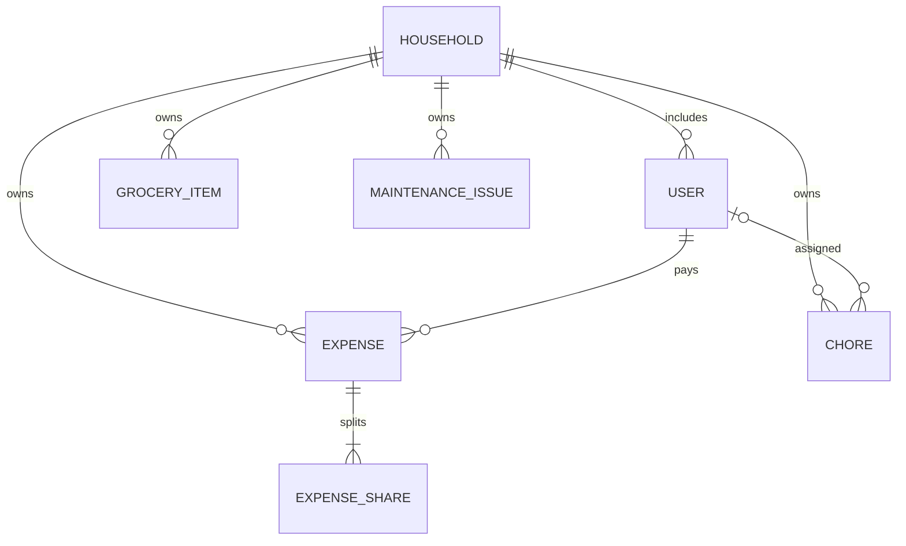

# Architecture and engineering decisions

## Scope

NestSync is a household-scoped modular monolith. The React application and Java API are separately packaged; the backend remains one deployable service. This keeps a portfolio-scale application understandable without adding distributed-system failure modes prematurely.

## Data relationships

An expense share stores a participant ID and a decimal amount in an element-collection table. Users cannot currently delete their account or leave an active household, so historical share IDs remain valid within the supported workflow. A future departure/account-deletion feature must preserve historical identity and financial records.

## Request flow and authorization

1. `JwtFilter` validates signature, issuer, and expiry, then establishes the Spring Security principal.
2. `CurrentUser` resolves that principal to the persisted account; the client cannot select a different acting user.
3. Request records in `Requests` define the accepted writable fields and Bean Validation rules.
4. Services resolve the authenticated account’s household and use household-scoped repository queries.
5. Missing and cross-household item IDs both return 404. This also avoids revealing whether another home owns a record.
6. A transaction completes the write. Response serialization never includes password hashes or nested household links.

The browser stores bearer credentials in `sessionStorage`, so authentication is tab-scoped. This avoids an ambient authentication cookie and its CSRF behavior, but it does not protect against XSS. Rendering untrusted HTML is avoided. Production work should evaluate an HttpOnly cookie/CSRF design, content security policy, rate limiting, and token revocation.

CORS is restricted to configured origins. The H2 console is disabled. The health endpoint exposes status only. OpenAPI is public for developer inspection and can be disabled with Springdoc configuration when appropriate.

## Household membership

Registration atomically creates an account and a household with a UUID invite code. The invite grants access to that home, so treat it as a private capability.

Joining is allowed only from a household with one member and no expenses, chores, groceries, or maintenance records. Joining the same home is idempotent. The old empty home is removed after the account changes household.

This MVP gives all household members equal permission over household records. Invite expiry/rotation, member roles, departures, concurrent membership-change guards, and edit audit trails are roadmap work. Do not interpret the current access model as a production tenant-administration system.

## Money and balance semantics

- Currency is USD throughout this version.
- Valid expense amounts are positive, at most `9999999999.99`, and at most two decimal places.
- Java uses `BigDecimal`; the split calculator converts the amount to integer cents with exact conversion.
- Shares are based on all current members at creation. Participants are sorted by user ID.
- Divide cents by participant count; give one remainder cent to each earliest participant until exhausted.
- An edit recalculates amounts for the **original** participant IDs and preserves the payer.
- A member’s net balance is the total they paid minus the total of their shares.
- Balances are derived from expense records; there is no separately editable balance table that can drift out of sync.

For a $10.00 bill shared by three members, shares are $3.34, $3.33, and $3.33. If the first member paid, balances are +$6.66, −$3.33, and −$3.33, summing to $0.00.

This is an expense ledger, not a payment processor. Sending money outside the app does not currently change a balance. Settlement records must be implemented before claiming that a household is financially settled.

## Persistence and configuration

The `dev` profile uses a local file-backed H2 database. Automated tests use isolated in-memory H2 by default; CI reruns API integration cases against MySQL 8.4. The `mysql` profile requires a database password and persistent signing secret.

Hibernate `ddl-auto=update` is convenient for this MVP’s local/container setup. It is not a migration strategy. Versioned migrations, backups, restore verification, and a production `validate` schema mode are prerequisites for a public deployment.

## Frontend organization

- `auth/`: session state and the authentication provider.
- `api/`: base URL, bearer injection, session-expiry behavior, and readable errors.
- `hooks/useResource`: cancellable resource fetching and explicit retries.
- `components/`: application navigation, headings, form fields, loading, and errors.
- `pages/`: behavior for each household workflow.
- `utils/`: display formatting and cent-based UI totals.

The UI includes semantic labels, visible keyboard focus, a skip link, empty/loading/error states, and responsive layouts. A full accessibility audit is tracked separately; these design choices are not a certification.

## Evolution from the uploaded prototype

| Original concern | Updated implementation |
| --- | --- |
| Authentication returned success strings without checking credentials | Persistent registration, BCrypt verification, and signed expiring JWTs |
| API routes permitted all requests | Authenticated, household-scoped access |
| Hard-coded JWT key and wildcard CORS | Environment-driven secrets and origin allowlist |
| Placeholder dashboard, balance, profile, and notification data | Data-backed dashboard, balances, profile; unimplemented notifications removed |
| `Double` money and no split calculation | `BigDecimal`, cent-preserving shares, derived net balances |
| Controllers wrote directly to repositories; service drafts had `.java.txt` extensions | Compiled transactional services and thin validated controllers |
| Not-found reads returned null | Consistent 404 problem responses |
| No test or delivery setup | Unit/API/component/browser tests, coverage gates, MySQL validation, container smoke test, and GHCR delivery |

## Current tradeoffs

List endpoints are unpaginated and balance calculations scan household expenses. This is suitable for a small demonstration dataset; larger use requires pagination, measured query optimization, and potentially ledger aggregation. There is no concurrent-edit version check, event queue, automated notification scheduler, multi-currency conversion, or receipt store. The roadmap makes these limitations explicit.
